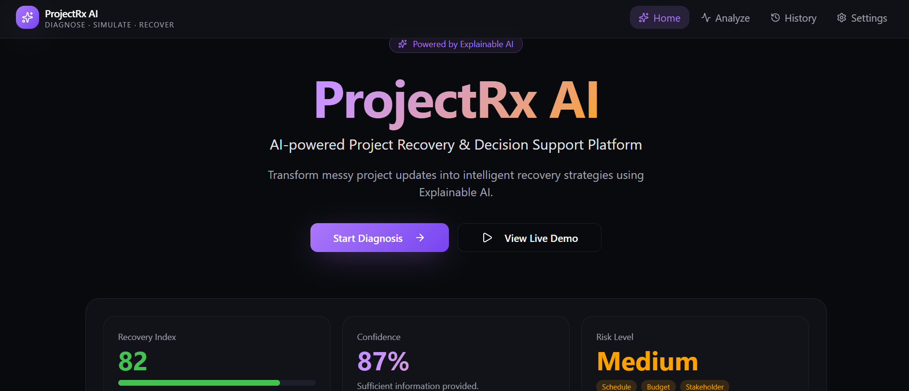
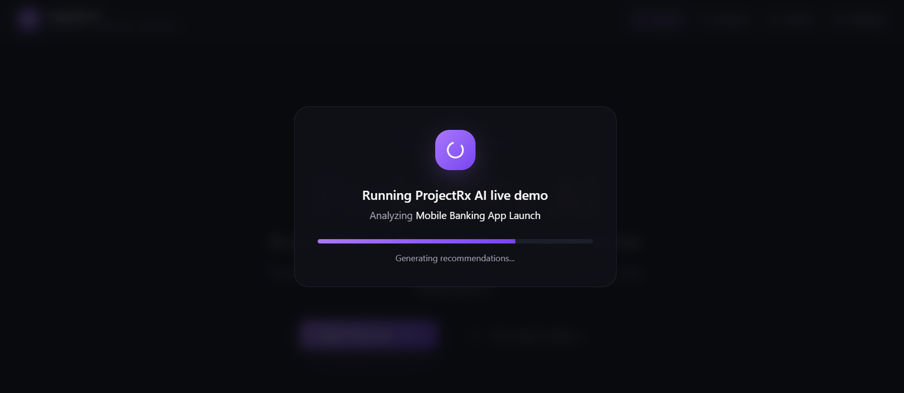
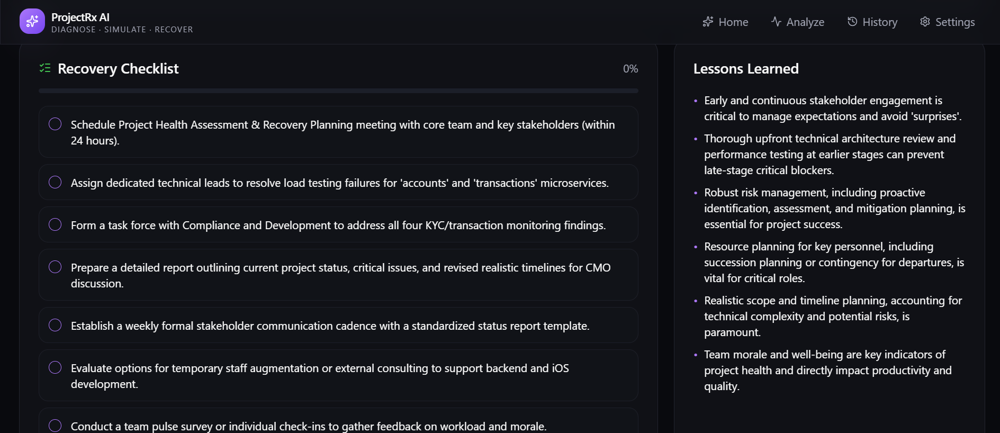
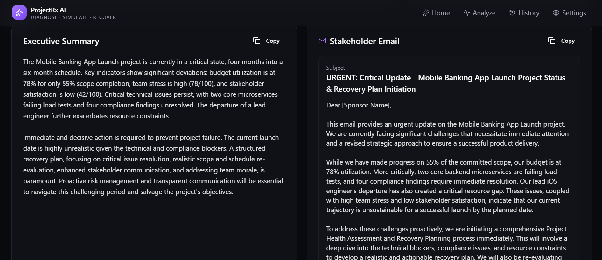
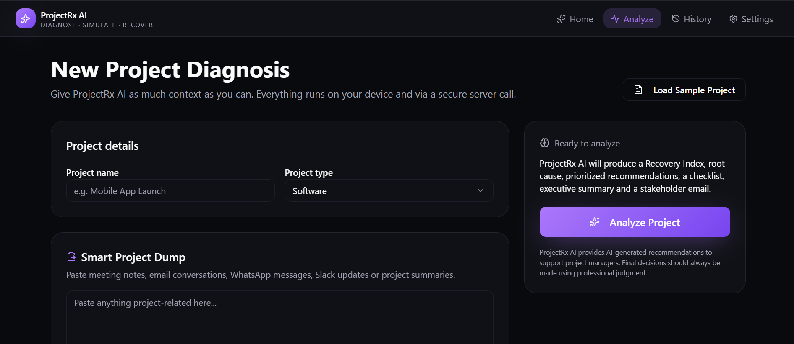
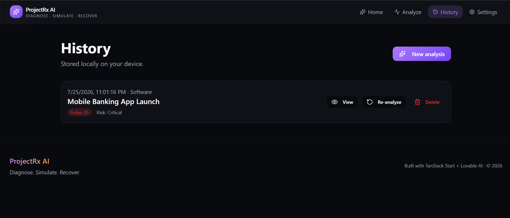
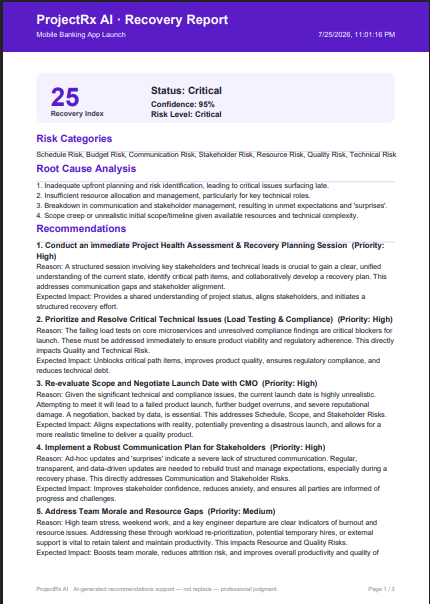

# 🚀 ProjectRx AI

> **Diagnose. Simulate. Recover.**

### AI-Powered Project Recovery & Decision Support Platform

ProjectRx AI is an **Explainable AI-powered decision support platform** designed to help project managers identify project risks early, simulate recovery strategies, and generate actionable recommendations before project issues become critical.

Unlike traditional project management tools that focus primarily on task tracking, ProjectRx AI transforms unstructured project information into intelligent, structured insights that support better project recovery decisions.

The platform is designed for **Project Managers, Startup Founders, NGOs, Student Teams, Event Managers, and Small Businesses**, enabling them to monitor project health, understand project risks, improve stakeholder communication, and make informed recovery decisions with confidence.

---

# 🌍 Problem Statement

Projects often fail because critical issues are discovered too late. Important project information is usually scattered across meeting notes, emails, chat conversations, and informal status updates, making it difficult to understand the true health of a project.

Traditional project management software helps organize work but rarely provides intelligent decision support or practical recovery recommendations.

ProjectRx AI addresses this challenge by combining Explainable AI with project management best practices to transform raw project information into structured analysis, recovery planning, and stakeholder-ready communication.

---

# 💡 Solution

ProjectRx AI provides an intelligent end-to-end project recovery workflow.

Users can either:

- Paste project notes, meeting summaries, or status updates
- Complete a structured project diagnosis form
- Load a sample project for demonstration

The AI then analyzes the project and generates:

- Project Recovery Index
- AI Confidence Score
- Root Cause Analysis
- PMBOK-inspired Risk Classification
- Recovery Recommendations
- Recovery Checklist
- Lessons Learned
- Executive Summary
- Stakeholder Email
- Assumptions
- Missing Information

Users can further evaluate different recovery strategies using the interactive **What-If Recovery Simulator**, allowing them to compare possible project outcomes before making real-world decisions.

Rather than replacing project managers, ProjectRx AI functions as an **AI Decision Support System**, empowering professionals to make faster, better-informed decisions.

---

# 🎯 Target Users

- Project Managers
- Product Managers
- Startup Founders
- NGOs
- Student Project Teams
- Event Managers
- Small Businesses

---

# 🔗 Live Application

**ProjectRx AI**

[https://projectrx-ai.lovable.app](https://project-resilience.lovable.app)

---

# 💻 GitHub Repository

[https://github.com/aqsam0018-beep/projectrx-ai](https://github.com/aqsam0018-beep/projectrx-ai)

---

# ✨ Key Features

- AI-powered Project Diagnosis
- Explainable AI (XAI)
- Project Recovery Index (0–100)
- AI Confidence Score
- PMBOK-inspired Risk Classification
- Root Cause Analysis
- Interactive What-If Recovery Simulator
- AI-generated Recovery Recommendations
- Interactive Recovery Checklist
- Lessons Learned Generator
- Executive Summary Generator
- Stakeholder Email Generator
- Markdown Export (.md)
- PDF Report Export
- Analysis History
- Sample Project Demonstration
- Dark & Light Theme Support
- Responsive Dashboard
- Mobile-Friendly Interface

---

# ⭐ Core Capabilities

### Explainable AI (XAI)

Every recommendation is accompanied by reasoning, helping users understand why the AI suggests a particular recovery strategy.

### Project Recovery Index

Calculates an overall project health score on a 0–100 scale to quickly communicate project status.

### AI Confidence Score

Provides an estimate of the reliability of the generated analysis based on the available project information.

### PMBOK-inspired Risk Classification

Categorizes project risks into commonly recognized project management domains including Schedule, Budget, Quality, Resource, Communication, Stakeholder, and Technical Risks.

### Recovery Simulator

Allows users to evaluate multiple recovery strategies before implementing changes in real projects.

---

# 🤖 AI Integration

ProjectRx AI integrates Artificial Intelligence through the **AI SDK** using the **Lovable AI Gateway (OpenAI-Compatible)**.

The AI engine performs:

- Project Health Analysis
- Risk Identification
- Root Cause Analysis
- Recovery Planning
- Executive Summary Generation
- Stakeholder Communication Drafting
- Lessons Learned Extraction
- Recovery Checklist Generation

The platform follows an **Explainable AI** approach by presenting not only recommendations but also the reasoning behind them, helping users understand how conclusions are reached.

ProjectRx AI is intended to **support project managers rather than replace professional judgment**.

---

# 🛠 Technology Stack

### Frontend

- React 19
- TypeScript
- TanStack Start
- Tailwind CSS
- Vite

### AI

- AI SDK
- Lovable AI Gateway (OpenAI-Compatible)

### Libraries

- Recharts
- jsPDF
- React Hook Form
- Zod

### Development

- Lovable
- GitHub
- GitHub Pages / Lovable Deployment

---

# 📸 Screenshots

The following screenshots demonstrate the complete ProjectRx AI workflow from project data input and AI-powered diagnosis to recovery planning, stakeholder communication, project history, and PDF report generation.

## 1. Landing Page



---

## 2. How It Works


---

## 3. Running Live Demo



---

## 4. Sample Analysis


---

## 5. Root Cause Analysis & What-if Simulator


---

## 6. Recovery Checklist & Lessons Learned



---

## 7. Executive Summary & Stakeholder Email



---

## 8. Project Diagnosis Form



---

## 9. History



---

## 10. PDF Report



---

# ⚙️ How to Run the Project

Clone the repository:

```bash
git clone https://github.com/aqsam0018-beep/projectrx-ai.git
```

Navigate to the project directory:

```bash
cd projectrx-ai
```

Install project dependencies:

```bash
npm install
```

Run the development server:

```bash
npm run dev
```

---

# 🔐 Environment Variables

This project requires an API key for AI functionality.

Store API credentials securely using environment variables provided by your hosting platform.

Example:

```env
LOVABLE_API_KEY=YOUR_API_KEY
```

**⚠️ Never commit API keys or other secrets to the repository. Keep them securely stored as environment variables.**

---

# 🚀 Future Enhancements

- User Authentication
- Team Collaboration
- Cloud Project Storage
- Jira Integration
- Trello Integration
- Calendar Integration
- Predictive Project Forecasting
- Advanced Analytics Dashboard
- Multi-language Support

---

# 📈 Expected Impact

ProjectRx AI demonstrates how Explainable AI can enhance project management by converting fragmented project information into structured, actionable intelligence.

The platform enables project teams to identify risks earlier, evaluate recovery strategies before implementation, improve stakeholder communication, and make more informed decisions throughout the project lifecycle.

By combining AI-assisted analysis with established project management principles, ProjectRx AI helps improve transparency, decision quality, and overall project resilience.

---

# 👩‍💻 Author

**Aqsa Malik**

Final Project Submission  
**ACT AI National AI Training Program (2026)**

GitHub Profile:

[https://github.com/aqsam0018-beep](https://github.com/aqsam0018-beep)

---

## 📄 License

This project was developed for educational and demonstration purposes as part of the **ACT AI National AI Training Program Final Project**.

---

**ProjectRx AI — Diagnose. Simulate. Recover.**

*Built with TanStack Start + Lovable AI · © 2026*
